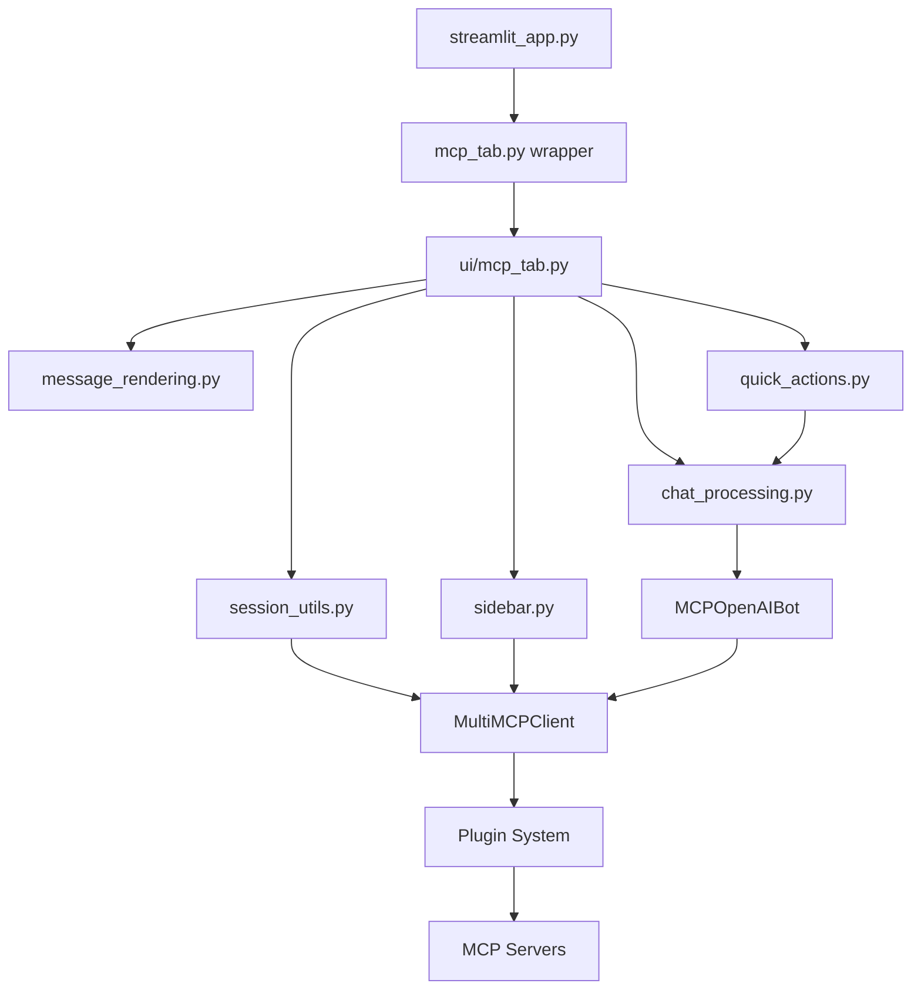

# MCP Integration UI Architecture Documentation

This document provides a comprehensive overview of the MCP Integration UI architecture after the successful 6-step refactoring that split the monolithic `mcp_tab.py` into a modular, maintainable structure.

## Overview

The MCP Integration UI is built around a **plugin-based architecture** that enables dynamic MCP server integration with Streamlit. The system was refactored from a single 300+ line file into 6 specialized modules, following separation of concerns principles.

## Directory Structure

```
/workspaces/Agent-Framework/mcp_integration/
├── mcp_tab.py                    # Compatibility wrapper (top-level)
├── ui/                           # UI module directory
│   ├── __init__.py              # Package initialization
│   ├── mcp_tab.py               # Main UI orchestration
│   ├── session_utils.py         # Session state management
│   ├── sidebar.py               # Sidebar rendering
│   ├── message_rendering.py     # Chat message display
│   ├── quick_actions.py         # Quick action utilities
│   └── chat_processing.py       # AI chat processing
├── core/                        # Business logic
│   └── multi_client.py          # MultiMCPClient
│   └── mcp_openai_bot.py        # OpenAI integration
└── docs/                        # Documentation
    └── ui_architecture.md       # This file
```

## File-by-File Architecture Analysis

### 1. `/mcp_integration/mcp_tab.py` (Compatibility Wrapper)

**Purpose**: Maintains backward compatibility with existing imports while exposing the refactored functionality.

**Responsibilities**:
- Re-exports functions from specialized UI modules
- Preserves `streamlit_app.py` import compatibility
- Acts as a stable API facade

**Key Functions Exported**:
- `render_mcp_tab` - Main UI entry point
- `draw_mcp_messages` - Message rendering function  
- `process_mcp_message` - Chat processing function

**Import Sources**:
```python
from ui.mcp_tab import render_mcp_tab
from ui.message_rendering import draw_mcp_messages  
from ui.chat_processing import process_mcp_message
```

**Usage**: Imported by `src/streamlit_app.py` via `from mcp_tab import render_mcp_tab`

---

### 2. `/mcp_integration/ui/mcp_tab.py` (Main UI Orchestration)

**Purpose**: Central UI coordinator that manages the overall MCP tab flow and delegates to specialized helpers.

**Responsibilities**:
- Orchestrates the complete MCP tab user experience
- Coordinates between session, sidebar, messaging, and chat processing
- Handles user input and chat interface
- Manages main content area layout

**Key Function**:
- `render_mcp_tab()` - Async main UI rendering function

**Architecture Pattern**: 
- **Composition over inheritance** - Uses helper modules rather than internal methods
- **Single Responsibility** - Focused on UI flow coordination, not implementation details

**Helper Dependencies**:
```python
from .session_utils import init_mcp_session       # Session management
from .sidebar import render_sidebar               # Sidebar UI
from .message_rendering import amessage_iter, draw_mcp_messages  # Message display
from .quick_actions import build_quick_actions, handle_quick_action  # Quick actions
from .chat_processing import process_mcp_message  # AI processing
```

**UI Flow**:
1. Initialize session state and MCP client
2. Render sidebar with server selection
3. Display existing messages
4. Render quick actions interface
5. Handle new user input
6. Process responses via OpenAI/MCP integration

---

### 3. `/mcp_integration/ui/session_utils.py` (Session State Management)

**Purpose**: Manages Streamlit session state initialization and MCP client setup.

**Responsibilities**:
- Initialize unique user IDs
- Set up MultiMCPClient connection
- Manage conversation state (messages, thread IDs)
- Handle server selection defaults
- Error handling for MCP connection failures

**Key Function**:
- `init_mcp_session(st_state) -> MultiMCPClient` - Async session initialization

**Session State Variables Managed**:
- `user_id` - Unique user identifier (UUID)
- `mcp_client` - MultiMCPClient instance
- `mcp_messages` - Conversation history (list[ChatMessage])
- `mcp_thread_id` - Conversation thread identifier
- `selected_mcp_server` - Currently selected MCP server

**Error Handling**: Displays user-friendly error messages and stops execution if MCP servers are unavailable.

---

### 4. `/mcp_integration/ui/sidebar.py` (Sidebar Rendering)

**Purpose**: Renders the complete Streamlit sidebar with server selection and status information.

**Responsibilities**:
- Server selection dropdown with icons and names
- New chat button functionality
- Server tools display (first 8 tools + overflow indicator)
- Server status indicators
- Conversation tracking information

**Key Function**:
- `render_sidebar(mcp_client, st_state) -> str` - Async sidebar rendering, returns selected server ID

**UI Components**:
1. **Server Selection**: Dynamic dropdown populated from available MCP servers
2. **Tools Expander**: Shows available tools with descriptions (limited to 8 for UI performance)
3. **Status Expander**: Visual indicators for all servers (active vs inactive)
4. **Conversation Tracking**: Message count and thread ID display

**State Management**: Directly updates session state and triggers re-runs when server selection changes.

---

### 5. `/mcp_integration/ui/message_rendering.py` (Message Display)

**Purpose**: Handles conversion and rendering of chat messages in Streamlit format.

**Responsibilities**:
- Async message iteration
- ChatMessage type validation and error handling
- Streamlit chat component rendering
- Support for human/AI message differentiation

**Key Functions**:
- `amessage_iter(messages) -> AsyncGenerator[ChatMessage, None]` - Async message generator
- `draw_mcp_messages(messages_agen) -> None` - Async message rendering

**Message Types Supported**:
- `human` - User messages (rendered with user avatar)
- `ai` - Assistant responses (rendered with AI avatar)
- Error handling for unexpected message types

**Integration**: Works with `schema.ChatMessage` objects from the main application schema.

---

### 6. `/mcp_integration/ui/quick_actions.py` (Quick Action Utilities)

**Purpose**: Manages dynamic quick action generation and execution based on available MCP tools.

**Responsibilities**:
- Dynamic quick action list generation based on server tools
- Tool-to-action mapping for user-friendly descriptions
- Quick action execution via MCP integration
- UI updates and error handling for action execution

**Key Functions**:
- `build_quick_actions(server_tools) -> list[str]` - Generates user-friendly action list
- `handle_quick_action(action, mcp_client, selected_server, messages) -> None` - Async action execution

**Supported Tool Categories**:

**Filesystem Operations** (8 actions):
- list_directory → "List the contents of the directory"
- create_directory → "Create a new directory"  
- read_file → "Read a file"
- write_file → "Write to a file"
- move_file → "Move or rename a file"
- get_file_info → "Get file information"
- search_files → "Search for a specific file"

**Web Search** (5 actions):
- brave_web_search → "Search the web"
- brave_image_search → "Search for images"
- brave_video_search → "Search for videos"
- brave_news_search → "Search for news"
- brave_local_search → "Search for local businesses"

**Repository Operations** (4 actions):
- list_issues → "List repository issues"
- get_file_contents → "Get contents of a file from repository"
- create_repository → "Create a new repository"
- fork_repository → "Fork a repository"
- create_branch → "Create a new branch"

**Execution Flow**:
1. Validate action and server selection
2. Add user message to conversation
3. Process via `process_mcp_message`
4. Add AI response to conversation
5. Update UI with results
6. Handle errors gracefully

---

### 7. `/mcp_integration/ui/chat_processing.py` (AI Chat Processing)

**Purpose**: Handles AI-powered processing of user messages through OpenAI integration with MCP tool calling.

**Responsibilities**:
- Persistent MCPOpenAIBot instance management
- Conversation context building (last 20 messages)
- Server-specific context injection
- OpenAI chat completion with MCP tool integration
- Error handling for AI processing failures

**Key Function**:
- `process_mcp_message(user_input, mcp_client, selected_server, conversation_history) -> str` - Async AI processing

**Bot Management**:
- **Persistent instances**: One bot per MCP server (stored in session state)
- **Lazy initialization**: Bots created on first use per server
- **Server context**: Each bot knows which MCP server it's working with

**Context Building**:
- Incorporates last 20 messages for conversation continuity
- Adds server-specific context (name, description)
- Formats context for optimal AI understanding

**Integration Points**:
- Uses `core.mcp_openai_bot.MCPOpenAIBot` for AI processing
- Imports MCPOpenAIBot locally to avoid circular imports
- Integrates with `core.multi_client.MultiMCPClient` for tool calling

---

## Architecture Principles

### 1. **Separation of Concerns**
Each module has a single, well-defined responsibility:
- Session management separate from UI rendering
- Message rendering isolated from chat processing
- Quick actions decoupled from main UI flow

### 2. **Dependency Injection**
Helper modules receive dependencies as parameters rather than importing them directly:
```python
# Good: Dependencies passed as parameters
async def render_sidebar(mcp_client, st_state) -> str:

# Good: Local imports to avoid circular dependencies  
from core.mcp_openai_bot import MCPOpenAIBot  # imported locally
```

### 3. **Async-First Design**
All UI functions are async-compatible to support:
- MCP server communication
- OpenAI API calls
- Streamlit async operations

### 4. **Backward Compatibility**
The wrapper pattern ensures existing code continues working:
```python
# This still works after refactoring
from mcp_tab import render_mcp_tab
```

### 5. **Plugin Architecture Integration**
The UI seamlessly integrates with the plugin-based MCP system:
- Dynamic server discovery
- Tool-based quick action generation
- Server-specific context handling

## Data Flow Architecture



## Key Benefits of This Architecture

### 1. **Maintainability**
- Small, focused modules (50-100 lines each vs 300+ line monolith)
- Clear responsibility boundaries
- Easy to test individual components

### 2. **Reusability**  
- Helper functions can be imported by other modules
- Session management reusable across different UIs
- Message rendering can be used in different contexts

### 3. **Extensibility**
- New quick actions easily added to `quick_actions.py`
- New message types handled in `message_rendering.py`
- Additional UI components can reuse existing helpers

### 4. **Performance**
- Lazy loading of heavy dependencies (MCPOpenAIBot)
- Efficient session state management
- Optimized message rendering

### 5. **Developer Experience**
- Clear file organization
- Consistent async patterns
- Comprehensive error handling
- Type hints throughout

## Testing Strategy

Each module can be independently tested:

```python
# Example: Testing session initialization
from ui.session_utils import init_mcp_session
import streamlit as st

async def test_session_init():
    mock_state = st.session_state
    client = await init_mcp_session(mock_state)
    assert isinstance(client, MultiMCPClient)
    assert "user_id" in mock_state
```

## Future Evolution

The modular architecture supports future enhancements:

1. **Additional UI Components**: New modules can be added to `/ui/`
2. **Alternative Rendering**: `message_rendering.py` can be extended for different formats
3. **Enhanced Quick Actions**: `quick_actions.py` can support custom user actions
4. **Multi-Platform Support**: Core logic isolated from Streamlit-specific code

## Conclusion

The MCP Integration UI architecture demonstrates modern software engineering principles applied to AI-powered user interfaces. The 6-step refactoring transformed a monolithic structure into a maintainable, testable, and extensible system that preserves backward compatibility while enabling future growth.

The separation of concerns, dependency injection, and plugin integration create a robust foundation for building sophisticated MCP-enabled applications.